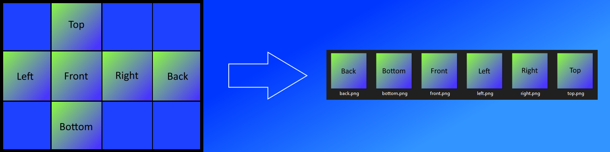
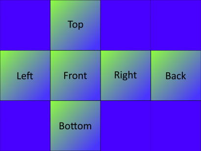
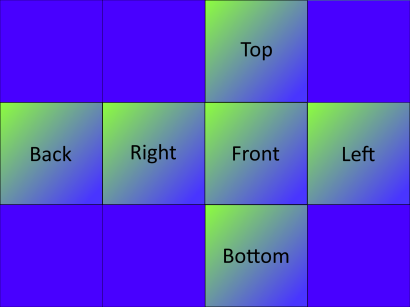
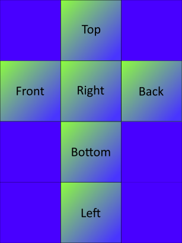

# Cubemap Splitter

> Python library to split up single file cubemaps into multiple block images.

Cubemap images are typically implemented as a single image.  Some applications and game engines require multiple images when setting up a cubemap.  This library takes the single image and writes subset block images (top, bottom, left, right, front, back) for a variety of formats.



## Installation

```
pip install cubemap_splitter
```
**Numpy 1.19.4 & 64bit Python**
Numpy version 1.19.3 will install alongside the package if it is not currently installed.  There is a bug with 64bit Python and Numpy 1.19.4:  
* https://github.com/opencv/opencv/issues/8139  
* https://developercommunity.visualstudio.com/content/problem/1207405/fmod-after-an-update-to-windows-2004-is-causing-a.html  
  
If you have Numpy 1.19.4 installed you will have to downgrade to 1.19.3.  This is not an issue on 32bit Python. 

## Usage

```
from cubemap_splitter import split_cubemap

# Automatically determine format and create new directory with images at original image location
split_cubemap("C:\\Users\\paulb\\Desktop\\cubemap_formats\\cubemap.png")

# Specify format and write to user defined directory
split_cubemap("C:\\Users\\paulb\\Desktop\\cubemap_formats\\cubemap.png", format_type=1, output_directory="c:/users/paulb/new_splits")

```

## Supported Formats
The following formats are supported.  Note that the format_type = "auto" default argument will likely suffice.  If the split images look incorrect, you can manually specify the format:

* format_type = 1  
  
  
  
* format_type = 2  
  
  
  
* format_type = 3  
  
  
* format_type = 4  
  
  
* format_type = 5    
  


## Release History

* 0.0.1
    * Initial Release

## Meta

Paul Burgess – paulburgess1357@gmail.com

Distributed under the MIT license. See ``LICENSE`` for more information.

[https://github.com/paulburgess1357/Cubemap-Splitter/blob/master/LICENSE]
